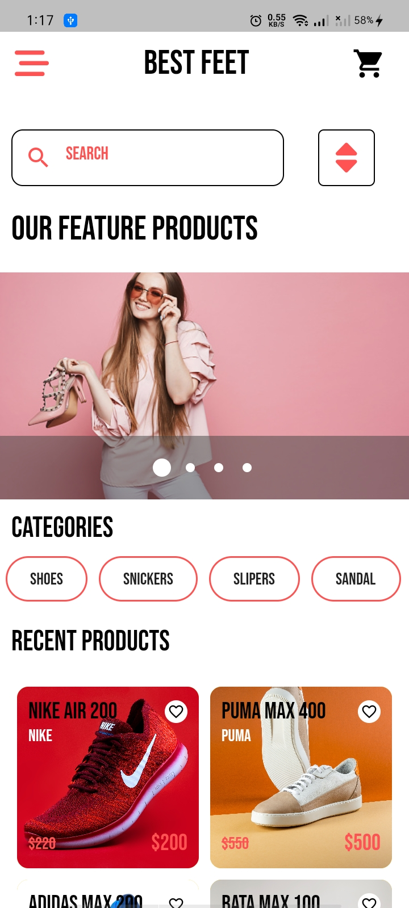
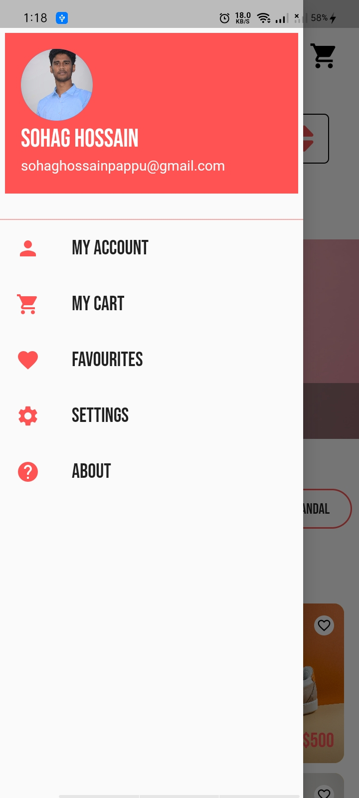
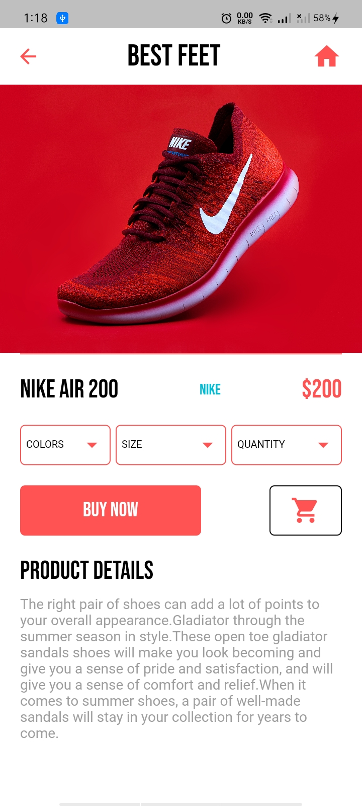
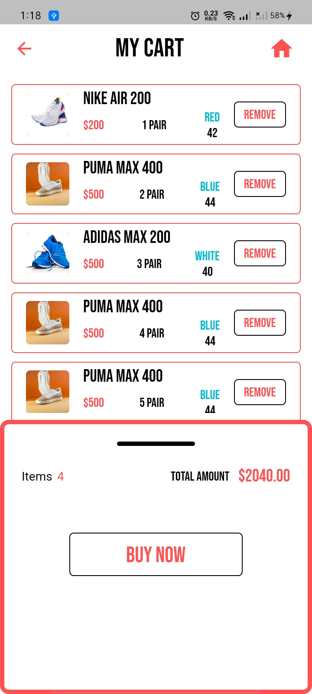

# SHOE SHOP APP

<h3> 📝📝 DESCRIPTION</h3>
  

It's basic UI design for mobile application.This app was built with flutter framework.It's an ecommerce app.🙆‍♂️🙆‍♂️

<h3>🛠🛠 TOOLS</h3>
<ul>
  <li><h5>Flutter</h5></li>
  <li><h5>Dart</h5></li>
</ul>  

  
### 🎨PREVIEW 
    

 <h3>🔗🔗LIVE PREVIEW</h3>
   
   
You can install this app in your phone .Go to the apk folder and install the apk file

